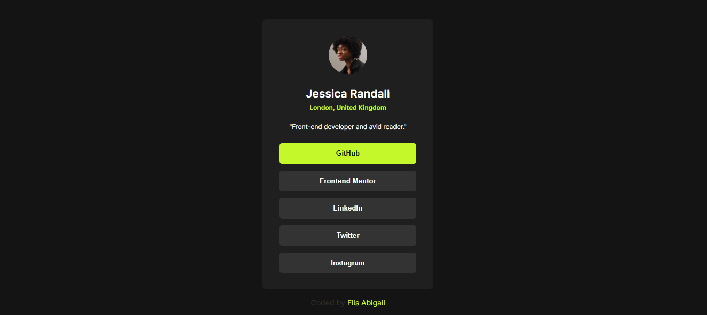

# Frontend Mentor - Social links profile solution

This is a solution to the [Social links profile challenge on Frontend Mentor](https://www.frontendmentor.io/challenges/social-links-profile-UG32l9m6dQ). Frontend Mentor challenges help you improve your coding skills by building realistic projects. 

## Overview

### Screenshot

### Links

- Solution URL: [Github](https://github.com/abigailelis/social-links-profile-challenge)
- Live Site URL: [Vercel](https://social-links-profile-challenge-abigail.vercel.app/)

### Built with

- Semantic HTML5 markup
- CSS custom properties
- Flexbox

## Author

- ### Elis Abigail

- Website - [Portafolio](https://portafolioelisabigail.vercel.app/home)
- Frontend Mentor - [@abigailelis](https://www.frontendmentor.io/profile/abigailelis)
